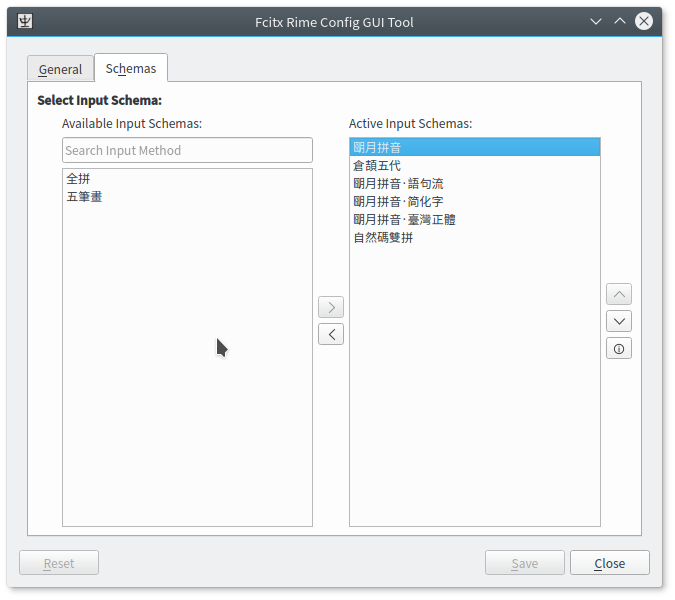

# Fcitx Rime Config GUI

This is a GUI config tool for fcitx-rime.

## Supported Config Options

- Toggle key
- Number of word candidates

## In-progress Config Options

- Western/Eastern switch key
- Traditional/Simplified switch key
- Half Shape/Full Shape switch key
- Page Up/Page Down key
- Ranked Active schema
- Enable/Disable schemas
- Select Default schema

## Planned Config Options

- Search available schemas
- Schema installation

## No-plan-yet Config Options

- Customize schemas

## BuildRequires

- fcitx-devel
- librime-devel1

## Requires

- fcitx
- fcitx-rime
- fcitx-qt5

